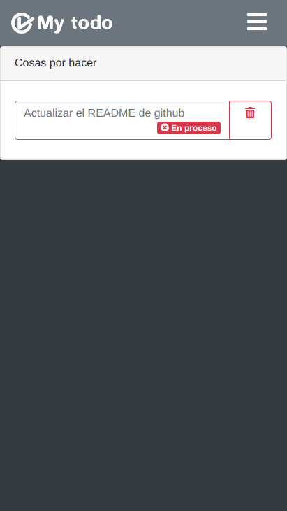
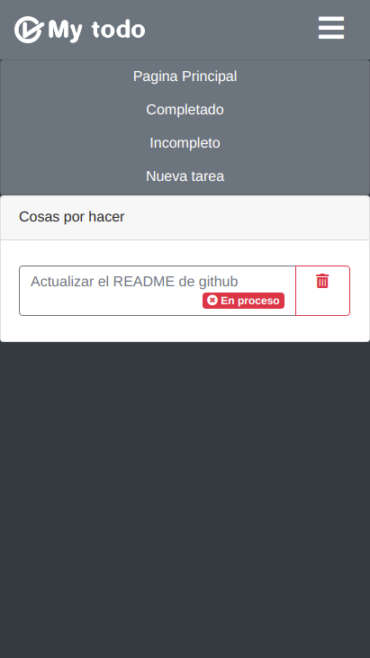
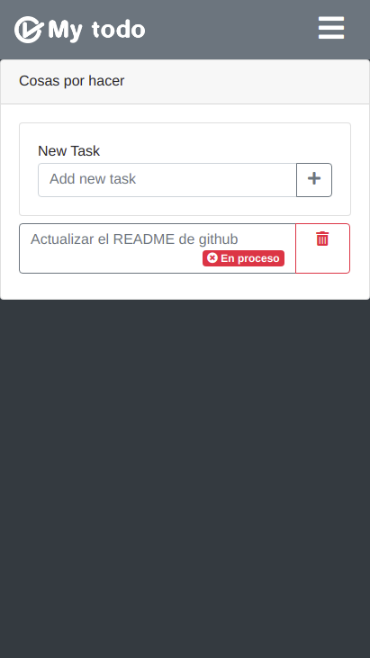
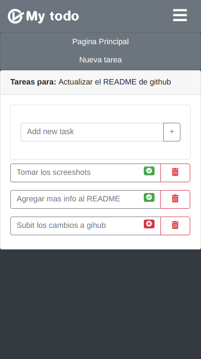

# Todo list app
This is a simple ToDo App powered by django. On the main menu you can create the title of the list and once you click on that new task you can add sub tasks. The main task is automatically updated when all the sub tasks are completed. 

Currently it only works best on phones but I'm planing to make it for big screens. I'm planing to add an option to create users as well.

## Screenshots

This is the main screen

This is the menu

This is the option to create a new task

This is the view for the sub tasks, the menu and the options

